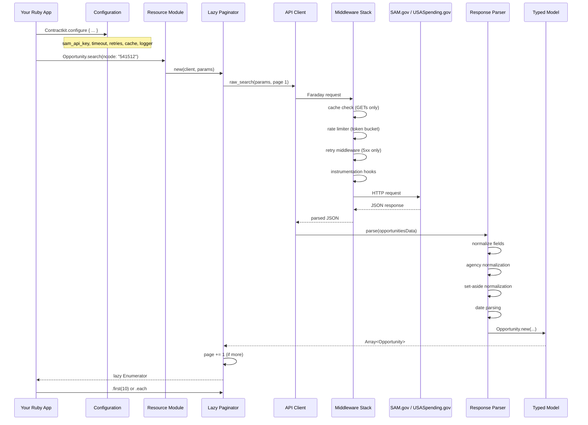
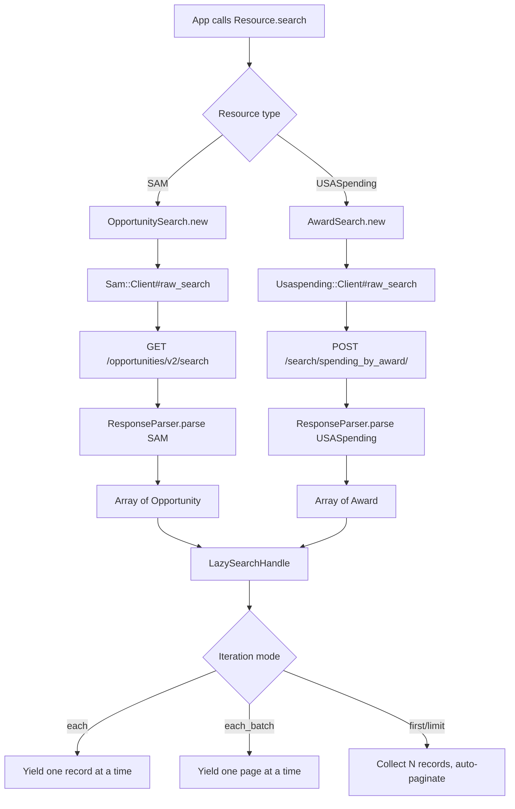
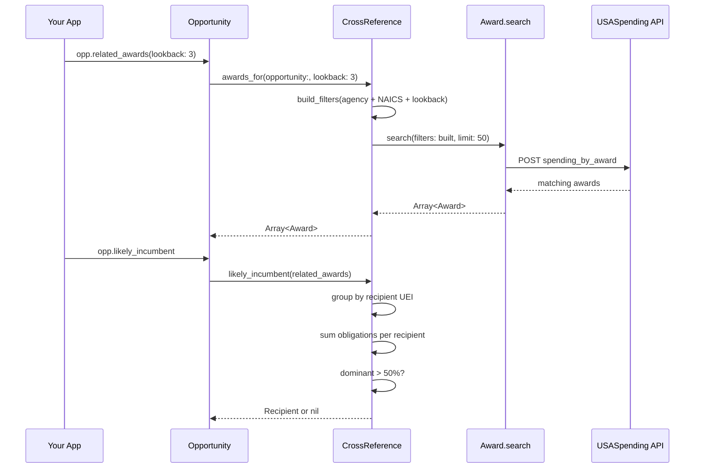
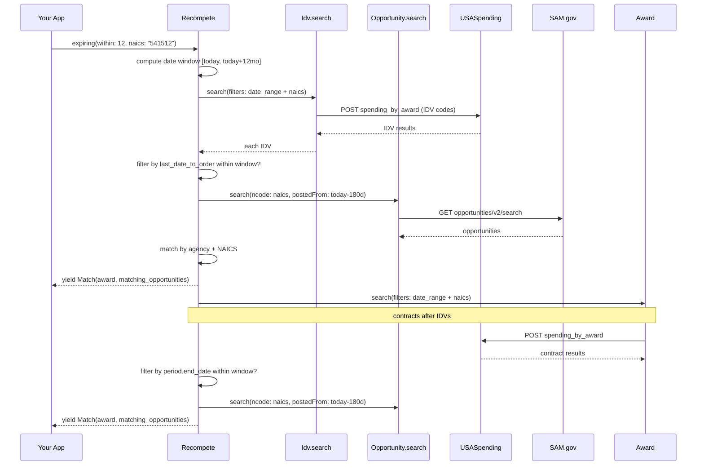
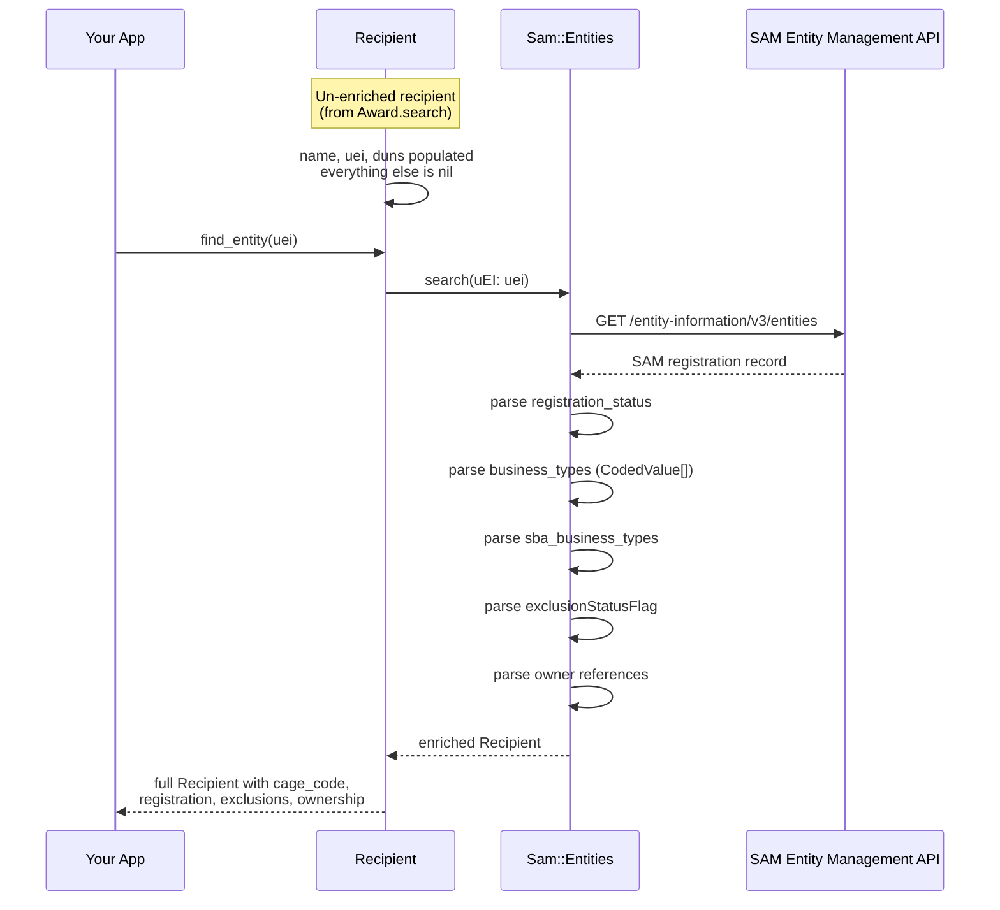
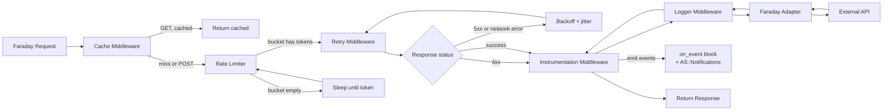

# Data Flow — contractkit

> **Purpose:** Visual maps of how data flows through the gem, from API
> request to typed model object. Mermaid diagrams render on GitHub and
> in most markdown viewers.
>
> **Audience:** AI agents, first-time contributors, anyone who wants to
> understand the gem's internal flow without reading source.

Related: [[architecture-overview]], [[data-models]], [[../domain/sam-gov]], [[../domain/usaspending]]

---

## Full request flow



## Resource query flow



## Cross-reference flow



## Recompete flow (time-forward)



## Entity enrichment flow



## Lazy model traversal (N+1 aware)

```mermaid
flowchart TD
    A[Award object] --> B{award.transactions}
    B --> C[Transaction.for_award(award_id)]
    C --> D[POST /api/v2/transactions/]
    D --> E[Array of Transaction]

    A --> F{award.subawards}
    F --> G[Subaward.for_award(award_id)]
    G --> H[POST /api/v2/subawards/]
    H --> I[Array of Subaward]

    A --> J{award.parent_idv}
    J --> K{parent_piid present?}
    K -->|yes| L[Idv.find_by_piid(piid)]
    L --> M[POST spending_by_award]
    M --> N[Idv object]
    K -->|no| O[nil]

    N --> P{idv.child_awards}
    P --> Q[Award.search with parent_piid filter]
    Q --> R[Array of Award]

    N --> S{idv.transactions}
    S --> T[Same as award.transactions]
```

## Middleware execution order



## Configuration flow

```mermaid
flowchart TD
    A[Contractkit.configure] --> B[Configuration singleton]
    B --> C{Access pattern}
    C -->|Global| D[Contractkit.configuration]
    C -->|Per-tenant| E[Client.new sam_api_key: ...]
    D --> F[Sam::Client.new<br/>uses global config]
    E --> G[Sam::Client.new<br/>uses instance config]
    F --> H[Faraday connection<br/>with global middleware]
    G --> I[Faraday connection<br/>with instance middleware]
    H --> J[API calls]
    I --> J
    Note over F,G: Fully isolated — mutating one<br/>doesn't affect the other
```
