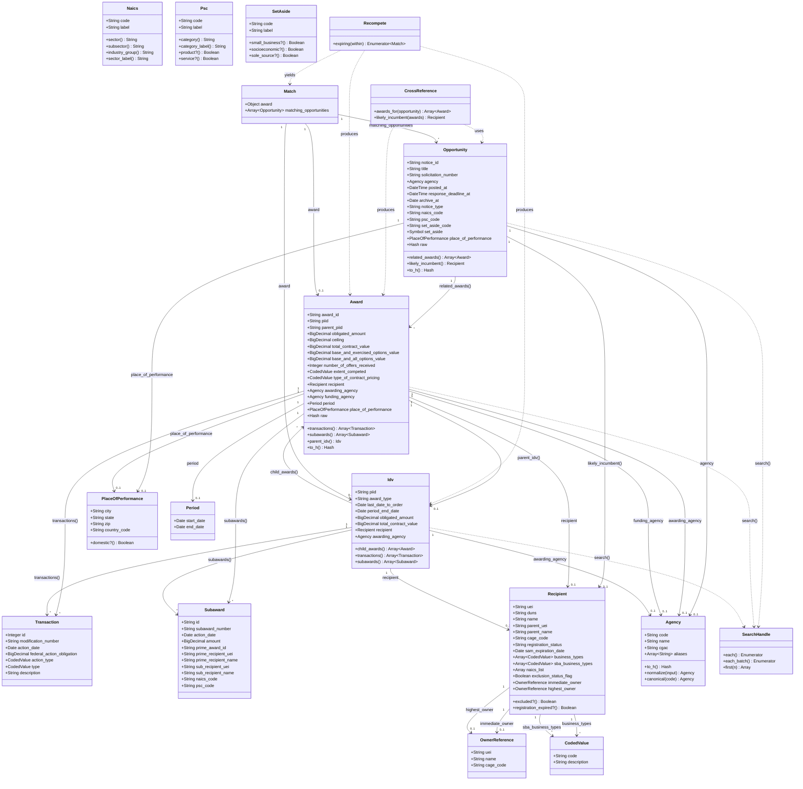
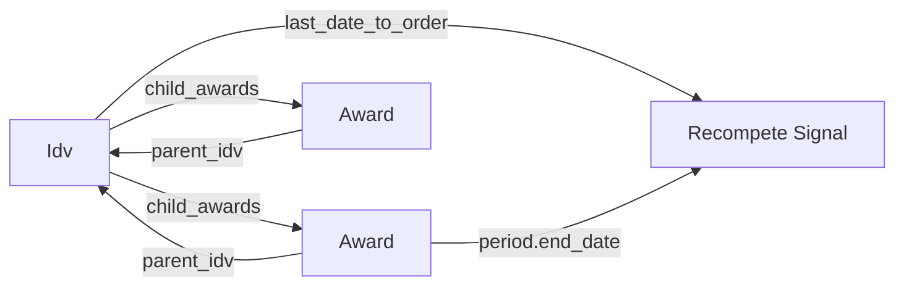
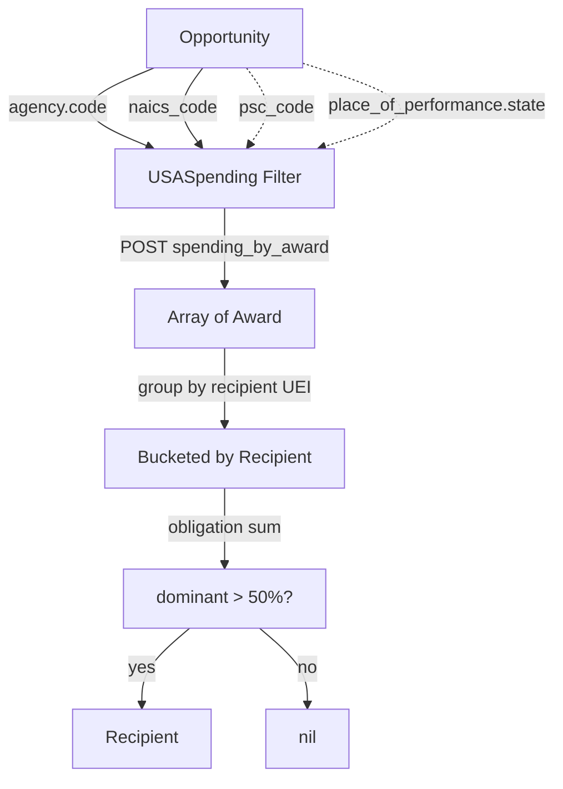
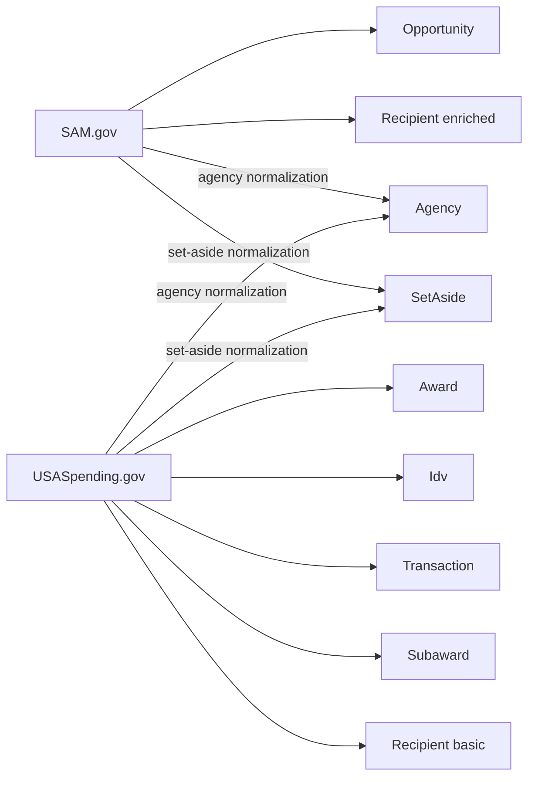

# Model Relationships

> **Purpose:** Mermaid class diagram showing how the gem's typed models,
> value objects, and cross-reference layers relate to each other.
>
> **Audience:** AI agents, contributors who need to understand the object
> graph before writing code.

Related: [[data-models]], [[data-flow]], [[../domain/cross-referencing]]

---

## Class diagram

## Parent/child traversal

## Cross-reference join keys

## Data source origins

